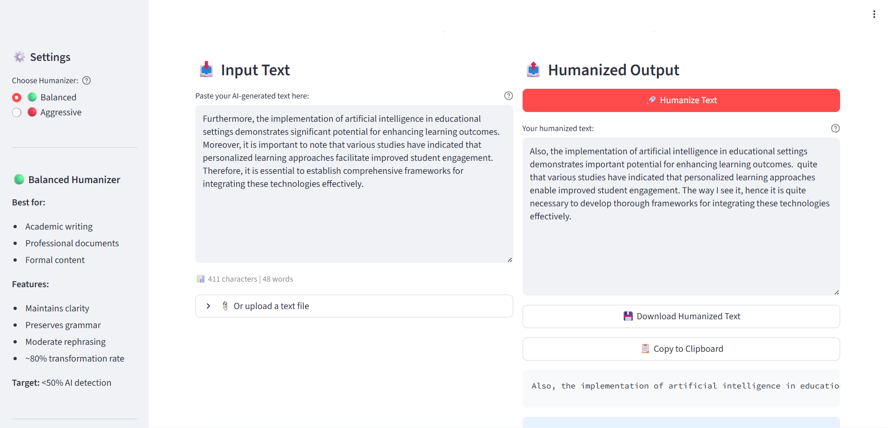
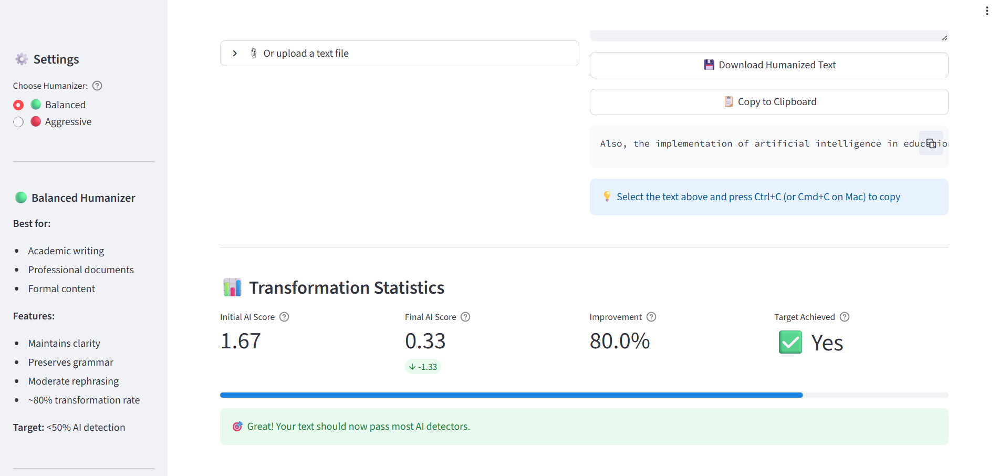
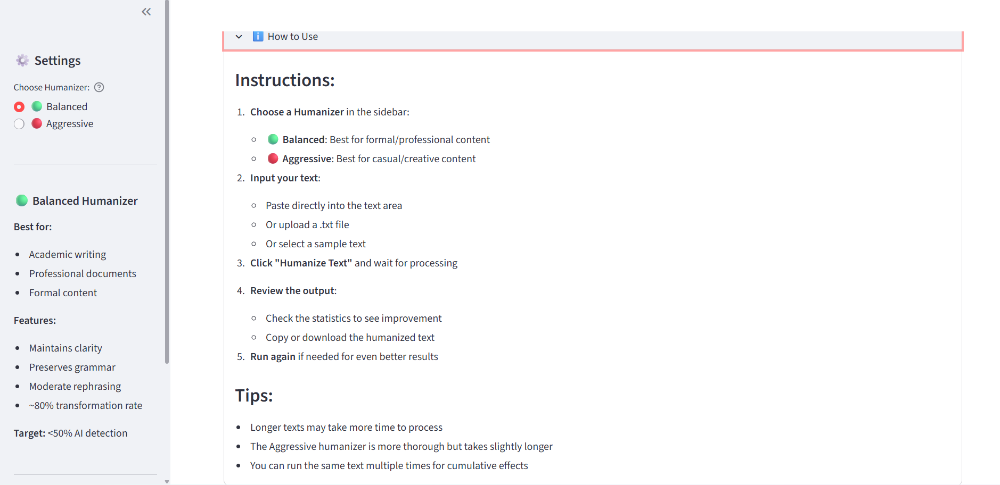
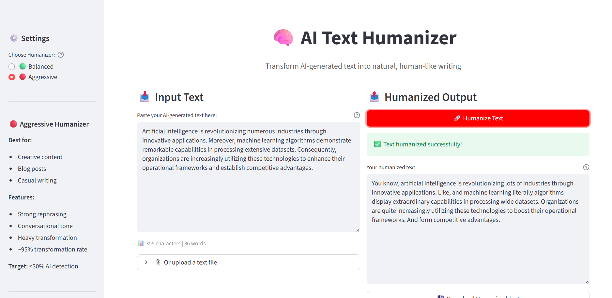

# 🧠 AI Text Humanizer - Web UI

A Streamlit-based web interface for the AI Text Humanizer project. Choose between **Balanced** and **Aggressive** humanizers to transform AI-generated text into natural, human-like writing.

## ✨ Features

- **Two Humanizer Options:**
  - 🟢 **Balanced**: Best for formal/professional content (~80% transformation rate)
  - 🔴 **Aggressive**: Best for casual/creative content (~95% transformation rate)

- **Easy-to-Use Interface:**
  - Paste or upload text
  - Select humanizer type
  - View transformation statistics
  - Download or copy results

- **Sample Texts:** Pre-loaded examples for quick testing

- **Real-time Statistics:** See AI detection scores and improvement metrics

## 🚀 Quick Start

### Prerequisites

- Python 3.8 or higher
- pip package manager

### Installation

1. **Navigate to the web_ui directory:**
   ```bash
   cd web_ui
   ```

2. **Install dependencies:**
   ```bash
   pip install -r requirements.txt
   ```

3. **Download spaCy language model:**
   ```bash
   python -m spacy download en_core_web_sm
   ```

### Running the App

Start the Streamlit app:

```bash
streamlit run app.py
```

The app will open in your default browser at `http://localhost:8501`

## 📖 How to Use

1. **Choose a Humanizer** in the sidebar:
   - 🟢 **Balanced**: For academic, professional, or formal content
   - 🔴 **Aggressive**: For blog posts, creative writing, or casual content

2. **Input your text** using one of these methods:
   - Paste directly into the text area
   - Upload a `.txt` file
   - Select a sample text from the dropdown

3. **Click "🚀 Humanize Text"** button

4. **Review the output**:
   - Check transformation statistics
   - Copy the humanized text
   - Download as a `.txt` file

5. **Run again** if needed for better results

## Understanding the Statistics

- **Initial AI Score**: How AI-like the original text appears (higher = more AI-like)
- **Final AI Score**: How AI-like the humanized text appears (lower = more human-like)
- **Improvement**: Percentage reduction in AI-like patterns
- **Target Achieved**: Whether the humanization goal was met
  - Balanced: <50% AI detection
  - Aggressive: <30% AI detection

## Use Cases

### Balanced Humanizer
- Academic papers and research
- Business communications
- Professional reports
- Technical documentation

### Aggressive Humanizer
- Blog posts and articles
- Social media content
- Creative writing
- Personal narratives

## 🛠️ Technical Details

### Architecture

```
web_ui/
├── app.py                 # Streamlit web interface
├── humanizer_core.py      # Core humanization classes
├── requirements.txt       # Python dependencies
└── README.md             # This file
```

### How It Works

1. **Text Analysis**: Detects AI patterns using regex and statistical methods
2. **Transformation**: Applies multiple humanization strategies:
   - Pattern removal (formal transitions)
   - Word replacement (formal → casual)
   - Contraction addition
   - Personality injection
   - Structure breaking
   - Conversational elements
3. **Quality Check**: Fixes spacing, capitalization, and awkward combinations
4. **Scoring**: Calculates improvement metrics

### Dependencies

- **streamlit**: Web interface framework
- **transformers**: Hugging Face transformers for NLP
- **spacy**: NLP processing
- **nltk**: Natural language toolkit
- **textstat**: Readability metrics
- **datasets**: Hugging Face datasets for training patterns
- **torch**: PyTorch for transformer models
- **scikit-learn**: Machine learning utilities
- **numpy & pandas**: Data processing

## Troubleshooting

### Common Issues

**"No module named 'humanizer_core'"**
- Make sure you're running the app from the `web_ui` directory

**"Can't find spacy model 'en_core_web_sm'"**
- Run: `python -m spacy download en_core_web_sm`

**Slow first run**
- The first humanization loads models and datasets (can take 1-2 minutes)
- Subsequent runs will be much faster

**Out of memory errors**
- Try with shorter text
- Close other applications
- Use Balanced instead of Aggressive humanizer

## Deployment

### Deploy to Streamlit Cloud

1. Push your code to GitHub
2. Go to [share.streamlit.io](https://share.streamlit.io)
3. Connect your GitHub repository
4. Select `web_ui/app.py` as the main file
5. Deploy!

### Local Network Access

To access from other devices on your network:

```bash
streamlit run app.py --server.address=0.0.0.0
```

Then access via: `http://YOUR_IP:8501`


## Acknowledgements

- Built using code from `humanizer_balanced.ipynb` and `humanizer_aggressive.ipynb`
- Powered by Hugging Face Transformers and spaCy
- UI built with Streamlit

---

**Images of the web UI **




